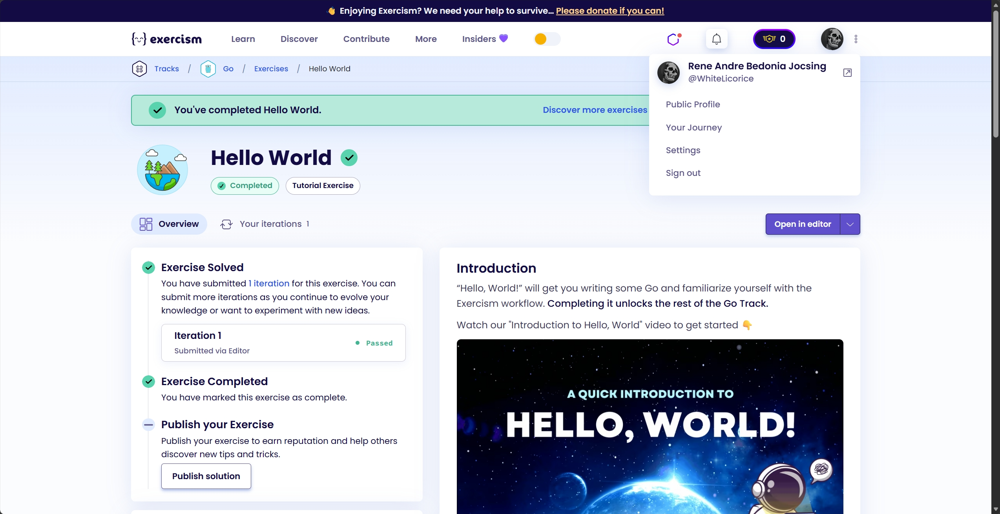

Lab 1 gives your group one month to build a scanner. That month should go to the scanner. Discovering in the final week that Gradle refuses to start on your laptop is what Lab 0 exists to prevent. Lab 0 exists so those discoveries happen now, while nothing world-changing is at stake. Its timeline runs in **two phases**. Setup, section 1, and one section of your group's choice from sections 2 to 8, is meant to finish in one sitting, while **August 17 through September 2** goes to the Exercism requirement in section 9. The practical exam follows on **September 3**. Lab 0 doesn't use the usual laboratory defense process since this is an onboarding step. See the syllabus for the course rules that still apply.

You're building a repository that any machine can build and run the same way, including mine. You need a working toolchain for a chosen programming language, two small scripts that give your interpreter one predictable way to run, and a GitHub Actions workflow that proves the whole thing works on a computer that isn't yours.

We won't use Docker or dev containers in this course. Every step below installs directly on your own machine. (Containerized workflows show up in CMSC 137: Data Communications and Networking, if your instructor there reaches that material.)

You're finished with Lab 0 when the **Actions** tab of your repository shows a green check on a commit containing `build.sh`, `run`, your language's version metadata, a `tests/lab0/` folder holding `hello.<ext>` with its `hello.expected` and `manifest.json` beside it, and a `.github/workflows/test.yml`. Don't start Lab 1 design work before you see that check.

---

## 1. Before You Start

You'll mostly do this work on Windows. That means we need to settle three shared tools before anyone disappears into a language-specific section: WinGet installs software, Git Bash runs the course's shell scripts, and Python runs the local test harness. Windows doesn't include all three out of the box.

### Windows First

Open **PowerShell** and check that WinGet is available:

```powershell
winget --version
```

If PowerShell can't find it, follow Microsoft's [WinGet installation guide](https://learn.microsoft.com/windows/package-manager/winget/) before continuing. Then install Git for Windows and the Python Install Manager:

```powershell
winget install --id Git.Git --exact --source winget
winget install 9NQ7512CXL7T --exact --accept-package-agreements --accept-source-agreements
```

Close PowerShell after both installers finish, then open a fresh PowerShell window. Install a Python 3 runtime and verify it:

```powershell
py install 3.14
python --version
```

Now open **Git Bash** from the Start menu. This is where you'll run every `chmod`, `build.sh`, `run`, `curl`, and local harness command in this manual, except for the C++ section, which specifies its own shell. Check that the tools crossed into the new terminal:

```bash
git --version
bash --version
python --version
```

If you already had any of these tools, you don't need to reinstall them. You do need all three verification commands to work from Git Bash. Installers often update `PATH`, the list of folders Windows searches for commands, only for terminals opened after the installation. When a newly installed command appears to be missing, close the terminal and open a new one before trying anything clever. Some installers never update `PATH` at all. For those, add the program's `bin` folder to `PATH` in Windows' environment settings, the way the Dart section adds `dart-sdk\bin`.

### Your Group and Repository

1. Every group member needs a GitHub account. If you don't have one yet, sign up at [github.com](https://github.com/) and verify your email address. Choose the username deliberately, since it appears on every commit you make, your instructor reads it while grading, and it tends to outlive the course. GitHub also requires two-factor authentication for accounts that contribute code, so turn it on now under **Settings**, then **Password and authentication**, and keep the recovery codes somewhere other than the phone running your authenticator app. While you're there, the [GitHub Student Developer Pack](https://education.github.com/pack) is free for enrolled students.

Then tell Git who you are:

```bash
git config --global user.name "Your Full Name"
git config --global user.email "your.email@example.com"
```

Use the email attached to your GitHub account. Your individual grade is computed from your commits, so commits that GitHub can't attribute to you are commits that didn't happen as far as grading is concerned. **Don't use a shared account for commits. This is a fast way to get a failing grade.**

Last, give your machine a way to prove it's you. GitHub stopped accepting passwords for Git over HTTPS in 2021, so a first `git push` asks for a password, refuses the one you type, and reports something that doesn't obviously mean "passwords don't work anymore."

On **Windows**, Git Credential Manager arrived with Git for Windows. Push once, authorize the browser window that opens, and your credentials are stored from then on.

On **Linux and macOS**, nothing equivalent is bundled, so use an SSH key. That's a pair of files: a private one that stays on your machine and a public one you hand to GitHub.

```bash
ssh-keygen -t ed25519 -C "your.email@example.com"
cat ~/.ssh/id_ed25519.pub
```

Paste that public key under **Settings**, then **SSH and GPG keys**, then **New SSH key**, and confirm it with `ssh -T git@github.com`. GitHub replies with your username and a note that it doesn't provide shell access, which is success despite reading like a refusal. Only the half ending in `.pub` is meant to leave your machine.

Then prove it end to end before going further: clone your group repository, commit something trivial, and push it. Everything else in Lab 0 assumes you can push.

2. Agree on a host language: Rust, Kotlin, Dart, C#, C++, Go, or Julia. The host language is the language you'll use to build your new interpreter across the semester. Read the short introductions below before you pick, then follow only your chosen language's setup section. Each one ends with a link to a finished reference project you can read when your own setup misbehaves.

3. Whatever you picked, your repository ends up with this structure at its root:

```
<repo-root>/
  build.sh                      <- builds your interpreter, once
  run                           <- executes it: ./run <path-to-source-file>
  <your language's version metadata>
  <your actual project source>
  tests/
    lab0/
      hello.<ext>
      hello.expected
      manifest.json
  .github/workflows/test.yml
```

4. Mark both scripts executable before committing them. Run this and every other shell command below from Git Bash on Windows, except where the C++ section specifies MSYS2 UCRT64:

```bash
chmod +x build.sh run
```

   Both are bash scripts, so don't run them from PowerShell. If the executable bit doesn't survive your commit, set it in the index directly:

```bash
git update-index --chmod=+x build.sh run
```

5. Commit your language's **version metadata**, the project files that tell tools which compiler or language releases your project accepts. Some languages can pin one exact release. Others can only set a compatible range or a minimum. Either way, this metadata keeps your group members' machines and the continuous integration (CI) runner from choosing versions by accident.

### The Contract

Every language section below works toward the same two commands. Nobody should have to know that your group chose Julia to build and test your work. I shouldn't. Neither should the test harness.

`./build.sh` builds your interpreter once, from a clean checkout.

`./run <path-to-source-file>` runs your interpreter on a single source file, and does so predictably.

Every command-line program writes to two separate output streams. **Standard output**, written `stdout`, is where a program's actual results go. **Standard error**, written `stderr`, is where its complaints go. They look identical in your terminal because both land on your screen, which is why the distinction is easy to miss until something depends on it. Something is about to. The test harness reads only stdout, so an error message written to the wrong stream shows up as corrupted program output.

So, three rules. Whatever your program prints goes to stdout. Error messages and diagnostics go to stderr. And the exit code, the number a program hands back to whatever launched it, says how things went: 0 means the file ran, 65 means your interpreter refused the file before running any of it, as with a syntax error, and 70 means the program started and then died partway through.

Those two strange numbers come from the old Unix `sysexits.h` convention. They're the ones jlox and clox use in Robert Nystrom's *Crafting Interpreters*. They'll matter for grading once your interpreter can tell a malformed program from a merely misbehaving one. For Lab 0, they don't matter at all. You need `hello.<ext>` to print one line, exit 0, and do nothing else.

Which brings up the obvious question. You haven't designed a language yet, so what goes in `hello.<ext>`? Anything. A `run` that ignores its argument entirely and prints your team name is a perfectly respectable Lab 0 interpreter. We're testing your plumbing this week.

### The Test Harness

Something has to hold you to that contract. It isn't me reading your scripts by hand. Every CI workflow below ends by downloading one Python script, [cmsc-124-harness](https://github.com/WhiteLicorice/cmsc-124-harness), and pointing it at a folder of tests. The same script assesses every group in the class no matter what language you picked. All it does is call your `./run` on each test file and compare what comes back against what you committed.

Since it can't guess your file extension, each test folder needs a `manifest.json` telling it. For Lab 0, this is the whole file:

```json
{
  "ext": ".src",
  "mode": "sidecar",
  "run_entrypoint": "./run"
}
```

Change `".src"` to whatever extension you plan to give your language's source files, and name `hello.<ext>` to match. Get this wrong and the script reports that it found no test files at all. That's a red X for a reason that has nothing to do with your interpreter, so double-check it. `"sidecar"` means expectations live in a neighboring file. `hello.expected` holds the exact stdout you expect. Exit codes get their own optional `hello.exit` file. You don't need one in Lab 0 because we're expecting 0.

You can and should run the same check locally before pushing, which is much faster than pushing and waiting on a runner. On Linux and macOS:

```bash
curl -sSL https://raw.githubusercontent.com/WhiteLicorice/cmsc-124-harness/v1.1/run_tests.py -o run_tests.py
python3 run_tests.py tests/lab0
```

On Windows, run the same download from Git Bash, then use the `python` command you verified earlier:

```bash
curl -sSL https://raw.githubusercontent.com/WhiteLicorice/cmsc-124-harness/v1.1/run_tests.py -o run_tests.py
python run_tests.py tests/lab0
```

The harness needs Python 3.9 or newer. It uses the bash that came with Git for Windows to launch your `run` script, so it doesn't need Windows Subsystem for Linux (WSL).

Note the `v1.1` in that URL. Your workflow pins a released version of the harness on purpose, so a fix I make in November can't retroactively change what passing meant for a defense you completed in September. When the pin needs to move, I'll say so through proper channels. Don't point your workflow at `main`.

Before you go to your section, a word about what your toolchain produces. Most choices leave a build artifact behind, such as a native executable, a Java launcher, or a .NET assembly. In those sections, `build.sh` produces the artifact and `run` executes it. Julia doesn't have a separate build step here, so its `build.sh` only resolves dependencies and `run` hands your interpreter source to Julia each time. The contract cares only about how `run` behaves.

Each language section begins with the same small Fibonacci program. It recursively computes the first ten numbers in the sequence, which isn't the fast way to do it, but it gives you a fair look at functions, branches, loops, types, and formatted output in each language. You don't have to use it for Lab 0. It's there so you can see what you're choosing before you install anything.

---

## 2. Rust

Start with Fireship's [Rust in 100 Seconds](https://www.youtube.com/watch?v=5C_HPTJg5ek) for a quick tour of the language.

Rust is built for software that needs speed, predictable resource use, and low-level control without giving up memory safety. It's common in command-line tools, network services, and embedded systems. If systems programming appeals to you, Rust will teach you how ownership and types can prevent bugs before your interpreter runs. The compiler is strict, but that's rather the point.

`Rust gets you a headstart for CMSC 125 next semester.`

### 2.1 A Quick Look at Fibonacci

Rust uses a `match` expression here, so the two base cases and the recursive case sit together:

```rust
fn fib(n: u64) -> u64 {
    match n {
        0 => 0,
        1 => 1,
        _ => fib(n - 1) + fib(n - 2),
    }
}

fn main() {
    for n in 0..10 {
        println!("fib({n}) = {}", fib(n));
    }
}
```

### 2.2 Manual Install

**Windows (PowerShell)**

Download and run `rustup-init.exe` from `https://rustup.rs`. Rust's default Windows toolchain also needs Microsoft's linker and native libraries. The installer may offer to install the required Visual Studio components. Accept that step. If you skip it, `rustc --version` may work while `cargo build` still fails when it tries to link an executable.

You can also install `rustup` through WinGet:

```powershell
winget install --id Rustlang.Rustup --exact
```

Close PowerShell when the installer finishes and verify Rust from a fresh Git Bash window.

**Linux**
```bash
curl --proto '=https' --tlsv1.2 -sSf https://sh.rustup.rs | sh
source "$HOME/.cargo/env"
```

**macOS**
```bash
xcode-select --install
curl --proto '=https' --tlsv1.2 -sSf https://sh.rustup.rs | sh
source "$HOME/.cargo/env"
```

**Verify**
```bash
rustc --version
cargo --version
```

### 2.3 Version Metadata

Add `rust-toolchain.toml` at the repo root. `rustup` reads the file on its own, so a fresh clone and the CI runner both select the requested channel without another command.

```toml
[toolchain]
channel = "stable"
```

`"stable"` follows the current stable channel, so it isn't an exact pin. Run `rustup show` after installing and replace it with the version you tested if your group wants one fixed compiler release.

### 2.4 `build.sh` / `run`

```bash
#!/usr/bin/env bash
# build.sh
set -e
cargo build --release
```

```bash
#!/usr/bin/env bash
# run
binary=./target/release/YOUR_PACKAGE_NAME
if [[ -f "$binary.exe" ]]; then
  binary="$binary.exe"
fi
exec "$binary" "$@"
```

`YOUR_PACKAGE_NAME` is the `name` field under `[package]` in `Cargo.toml`.

### 2.5 CI Wiring

GitHub's runners already ship `rustup`, and `rustup` picks up `rust-toolchain.toml` the first time `cargo` runs, so the workflow doesn't need a toolchain step at all.

```yaml
# .github/workflows/test.yml
name: lab-tests
on: [push]
jobs:
  test:
    runs-on: ubuntu-latest
    steps:
      - uses: actions/checkout@v7
      - run: chmod +x build.sh run
      - run: ./build.sh
      - run: curl -sSL https://raw.githubusercontent.com/WhiteLicorice/cmsc-124-harness/v1.1/run_tests.py -o run_tests.py
      - run: python3 run_tests.py tests/lab0
```

If you get stuck, there's a finished Rust project at [cmsc-124-lab0-rust](https://github.com/WhiteLicorice/cmsc-124-lab0-rust) with everything above already wired together. Its `README.md` records which parts were tested and which weren't. Read it when something misbehaves, but don't submit it. I'll know if you do.

---

## 3. Kotlin

Start with Fireship's [Kotlin in 100 Seconds](https://www.youtube.com/watch?v=xT8oP0wy-A0) for a quick tour of the language.

Kotlin is used for Android apps, server software, and projects that need to work with the Java ecosystem. Students who already know Java (and a little bit of Python) will have the shortest adjustment, though it's also a comfortable first look at Android development and automatic memory management. For this semester, its concise, Pythonic syntax and mature Java libraries let you spend more time on the interpreter and less time rebuilding basic collections.

### 3.1 A Quick Look at Fibonacci

Kotlin can make the entire function a `when` expression. The return type is `Long`, while string templates put values directly inside the output:

```kotlin
fun fib(n: Int): Long = when (n) {
    0 -> 0L
    1 -> 1L
    else -> fib(n - 1) + fib(n - 2)
}

fun main() {
    for (n in 0..9) {
        println("fib($n) = ${fib(n)}")
    }
}
```

### 3.2 Manual Install

All you install globally is a Java Development Kit (JDK). Your repository supplies the Gradle wrapper, which downloads the project's chosen Gradle release and Kotlin compiler on the first build. Don't install Gradle or Kotlin separately.

Section 1 left you inside the clone of your group's repository. Run the following commands from that repository's root in Git Bash. They copy the wrapper from the course's pinned Kotlin reference into your project without copying the finished interpreter setup.

```bash
mkdir -p gradle/wrapper
kotlin_ref=https://raw.githubusercontent.com/WhiteLicorice/cmsc-124-lab0-kotlin/v1.0
curl -fsSLo gradlew "$kotlin_ref/gradlew"
curl -fsSLo gradlew.bat "$kotlin_ref/gradlew.bat"
curl -fsSLo gradle/wrapper/gradle-wrapper.jar \
  "$kotlin_ref/gradle/wrapper/gradle-wrapper.jar"
curl -fsSLo gradle/wrapper/gradle-wrapper.properties \
  "$kotlin_ref/gradle/wrapper/gradle-wrapper.properties"
chmod +x gradlew
```

The wrapper isn't one file. Before you rely on it, your repository must contain `gradlew`, `gradlew.bat`, `gradle/wrapper/gradle-wrapper.jar`, and `gradle/wrapper/gradle-wrapper.properties`. Commit all four.

**Windows (PowerShell)**
```powershell
winget install --id EclipseAdoptium.Temurin.21.JDK --exact
```

Close PowerShell when the installer finishes and verify Java from a fresh Git Bash window.

**Linux (Debian/Ubuntu)**
```bash
sudo apt update
sudo apt install -y openjdk-21-jdk
```

**macOS**
```bash
brew install openjdk@21
sudo ln -sfn "$HOMEBREW_PREFIX/opt/openjdk@21/libexec/openjdk.jdk" /Library/Java/JavaVirtualMachines/openjdk-21.jdk
```

**Verify**
```bash
java -version
```

### 3.3 Version Metadata

The wrapper and build file share this job. Commit these and leave them alone:

- `gradle/wrapper/gradle-wrapper.properties`, which pins one Gradle distribution.
- `build.gradle.kts`, which pins one Kotlin plugin version, such as `kotlin("jvm") version "2.0.20"`.

### 3.4 `build.sh` / `run`

```bash
#!/usr/bin/env bash
# build.sh
set -e
./gradlew installDist -q
```

```bash
#!/usr/bin/env bash
# run
unset JAVA_HOME
exec ./build/install/YOUR_PROJECT_NAME/bin/YOUR_PROJECT_NAME "$@"
```

`YOUR_PROJECT_NAME` comes from `rootProject.name` in `settings.gradle.kts`. Clearing `JAVA_HOME` makes the launcher use the `java` command you verified above. An old JDK that another program left behind can otherwise take over. The `installDist` task comes from Gradle's `application` plugin, so check that `build.gradle.kts` applies it. Use it instead of `gradlew run`, because `installDist` builds once and leaves a launcher behind. Otherwise the harness pays the JVM and Gradle startup cost again on every single test file.

`I recommend using IntelliJ IDEA by Jetbrains for Kotlin since that IDE has first-class support for the language. They made the language, after all.`

### 3.5 CI Wiring

```yaml
name: lab-tests
on: [push]
jobs:
  test:
    runs-on: ubuntu-latest
    steps:
      - uses: actions/checkout@v7
      - uses: actions/setup-java@v5
        with: { distribution: temurin, java-version: '21' }
      - uses: gradle/actions/setup-gradle@v6
      - run: chmod +x build.sh run gradlew
      - run: ./build.sh
      - run: curl -sSL https://raw.githubusercontent.com/WhiteLicorice/cmsc-124-harness/v1.1/run_tests.py -o run_tests.py
      - run: python3 run_tests.py tests/lab0
```

If you get stuck, there's a finished Kotlin project at [cmsc-124-lab0-kotlin](https://github.com/WhiteLicorice/cmsc-124-lab0-kotlin) with everything above already wired together (it doesn't assume a specific IDE). Its `README.md` records which parts were tested and which weren't. Read it when something misbehaves, but don't submit it. I'll know if you do.

---

## 4. Dart

Start with Fireship's [Dart in 100 Seconds](https://www.youtube.com/watch?v=NrO0CJCbYLA) for a quick tour of the language.

Dart is designed for client applications and powers Flutter apps across mobile, desktop, and the web. It makes sense for students interested in app development or anyone who wants one approachable toolchain that can run code during development and compile it for release. In this project, Dart gives you a full-featured language without much build ceremony.

### 4.1 A Quick Look at Fibonacci

Dart's braces and `if` statements will look familiar if you've used C, Java, or JavaScript. Its string interpolation uses `$` for one value and `${...}` for an expression:

```dart
int fib(int n) {
  if (n < 2) {
    return n;
  }
  return fib(n - 1) + fib(n - 2);
}

void main() {
  for (var n = 0; n < 10; n++) {
    print('fib($n) = ${fib(n)}');
  }
}
```

### 4.2 Manual Install

**Windows**

Dart's official Windows package-manager instructions use Chocolatey, which Windows doesn't include. If you already have Chocolatey, open **PowerShell as Administrator**:

```powershell
choco install dart-sdk
```

If you don't have Chocolatey, use the SDK ZIP from Dart's [official installation page](https://dart.dev/get-dart) instead. Extract it, add the resulting `dart-sdk\bin` folder to your Windows `PATH`, then open a fresh Git Bash window.

**Linux (Debian/Ubuntu, via Google's apt repo)**
```bash
sudo apt update
sudo apt install -y apt-transport-https wget gnupg
wget -qO- https://dl-ssl.google.com/linux/linux_signing_key.pub | sudo gpg --dearmor -o /usr/share/keyrings/dart.gpg
echo 'deb [signed-by=/usr/share/keyrings/dart.gpg arch=amd64] https://storage.googleapis.com/download.dartlang.org/linux/debian stable main' | sudo tee /etc/apt/sources.list.d/dart_stable.list
sudo apt update
sudo apt install -y dart
```

**macOS**
```bash
brew tap dart-lang/dart
brew install dart
```

**Verify**
```bash
dart --version
```

### 4.3 Version Metadata

In `pubspec.yaml`:
```yaml
environment:
  sdk: '^3.5.0'
```

This is a compatible range. It accepts Dart 3 releases beginning with 3.5.0 and below 4.0.0. Record the exact SDK you tested in your repository documentation.

### 4.4 `build.sh` / `run`

```bash
#!/usr/bin/env bash
# build.sh
set -e
dart pub get
mkdir -p build
dart compile exe bin/main.dart -o build/interpreter
```

```bash
#!/usr/bin/env bash
# run
binary=./build/interpreter
if [[ -f "$binary.exe" ]]; then
  binary="$binary.exe"
fi
exec "$binary" "$@"
```

### 4.5 CI Wiring

```yaml
name: lab-tests
on: [push]
jobs:
  test:
    runs-on: ubuntu-latest
    steps:
      - uses: actions/checkout@v7
      - uses: dart-lang/setup-dart@v1
      - run: chmod +x build.sh run
      - run: ./build.sh
      - run: curl -sSL https://raw.githubusercontent.com/WhiteLicorice/cmsc-124-harness/v1.1/run_tests.py -o run_tests.py
      - run: python3 run_tests.py tests/lab0
```

If you get stuck, there's a finished Dart project at [cmsc-124-lab0-dart](https://github.com/WhiteLicorice/cmsc-124-lab0-dart) with everything above already wired together. Its `README.md` records which parts were tested and which weren't. Read it when something misbehaves, but don't submit it. I'll know if you do.

---

## 5. C\#

Start with Fireship's [C# in 100 Seconds](https://www.youtube.com/watch?v=ravLFzIguCM) for a quick tour of the language.

C# (pronounced "C sharp") is the general-purpose language most often used on the .NET platform. It runs desktop apps, server software, and cloud services, and Unity uses it for game scripts. Choose it if you want to build games with Unity, or if you like the braces and semicolons of Java or C++ but want automatic memory management and a large standard library.

`Our course site at renscourses.netlify.app is primarily built with C# and a lot of late nights and prayers. The tech stack is exotic. Check it out if you need inspiration for CMSC 128. I have it open-sourced.`

The language pool requires **C#**. You'll write `.cs` files, keep project settings in a `.csproj` file, and build everything with the cross-platform .NET SDK. You won't install GCC or create `.c` files in this section.

### 5.1 A Quick Look at Fibonacci

C# can express the three Fibonacci cases with a switch expression. The `$` before the output string turns the braces inside it into substitutions:

```csharp
static long Fib(int n) => n switch
{
    0 => 0,
    1 => 1,
    _ => Fib(n - 1) + Fib(n - 2)
};

for (var n = 0; n < 10; n++)
{
    Console.WriteLine($"fib({n}) = {Fib(n)}");
}
```

### 5.2 Manual Install

We're on .NET 10, the current long-term support (LTS) release. .NET 8 was the previous LTS and you'll still find it all over the internet, but its support ends in November 2026, partway through this course. Don't start there.

**Windows (PowerShell)**
```powershell
winget install --id Microsoft.DotNet.SDK.10 --exact
```

You can use Microsoft's .NET 10 SDK installer from `https://dotnet.microsoft.com/download/dotnet/10.0` instead. Either route installs the SDK and the runtime. Close the installer or PowerShell when it finishes, then verify .NET from a fresh Git Bash window.

**Linux (Ubuntu)**
```bash
sudo apt update
sudo apt install -y dotnet-sdk-10.0
```
If your distribution doesn't provide that package, Microsoft also publishes an install script that works across distributions:
```bash
curl -sSL https://dot.net/v1/dotnet-install.sh | bash -s -- --channel 10.0
```

**macOS**

Download the .NET 10 SDK installer from `https://dotnet.microsoft.com/download/dotnet/10.0`.

**Verify**
```bash
dotnet --version
```

### 5.3 Create the Project

Create the C# console project at your repository root. `--output .` puts `Program.cs` and `YOUR_PROJECT_NAME.csproj` beside `build.sh`, in the same directory.

```bash
dotnet new console --name YOUR_PROJECT_NAME --output .
```

### 5.4 Version Metadata

Add `global.json` at the repo root:
```json
{
  "sdk": {
    "version": "10.0.100",
    "rollForward": "latestFeature"
  }
}
```

This starts resolution at SDK 10.0.100, but `latestFeature` allows a later .NET 10 feature band. It keeps the project on .NET 10 without requiring every machine to preserve that first SDK build forever.

### 5.5 `build.sh` / `run`

```bash
#!/usr/bin/env bash
# build.sh
set -e
dotnet publish -c Release -o build
```

```bash
#!/usr/bin/env bash
# run
exec dotnet build/YOUR_PROJECT_NAME.dll "$@"
```

Replace `YOUR_PROJECT_NAME` with the name in your `.csproj` filename. This is a C# build. `dotnet publish` compiles the `.cs` source files in that project and places the result in `build/`.

### 5.6 CI Wiring

```yaml
name: lab-tests
on: [push]
jobs:
  test:
    runs-on: ubuntu-latest
    steps:
      - uses: actions/checkout@v7
      - uses: actions/setup-dotnet@v6
        with: { global-json-file: global.json }
      - run: chmod +x build.sh run
      - run: ./build.sh
      - run: curl -sSL https://raw.githubusercontent.com/WhiteLicorice/cmsc-124-harness/v1.1/run_tests.py -o run_tests.py
      - run: python3 run_tests.py tests/lab0
```

If you get stuck, there's a finished C# project at [cmsc-124-lab0-c-sharp](https://github.com/WhiteLicorice/cmsc-124-lab0-c-sharp) with everything above already wired together. Its `README.md` records which parts were tested and which weren't. Read it when something misbehaves, but don't submit it. I'll know if you do.

---

## 6. C++

Start with Fireship's [C++ in 100 Seconds](https://www.youtube.com/watch?v=MNeX4EGtR5Y) for a quick tour of the language.

C++ (pronounced "C plus plus") is used when software needs native performance and close control over memory and hardware. It shows up in systems, engines, and other performance-sensitive programs. Unreal Engine uses C++ for gameplay systems, often alongside Blueprint, its visual scripting language. Choose it if you want to build games with Unreal Engine or understand resource management and low-level abstractions, and you don't mind managing more compiler and platform detail yourself. C++ is separate from C#. Use this section only if your group selected C++.

`C++ gets you a head start for both CMSC 125 and CMSC 131.`

### 6.1 A Quick Look at Fibonacci

C++ makes the number type and the program's entry point explicit. Output is assembled with the `<<` operator:

```cpp
#include <cstdint>
#include <iostream>

std::uint64_t fib(unsigned int n) {
    if (n < 2) {
        return n;
    }
    return fib(n - 1) + fib(n - 2);
}

int main() {
    for (unsigned int n = 0; n < 10; n++) {
        std::cout << "fib(" << n << ") = " << fib(n) << '\n';
    }
}
```

### 6.2 Manual Install

**Windows**

C++ uses **MSYS2 UCRT64** in this manual. It gives you one shell where GCC, CMake, Ninja, and Python agree on paths. Open PowerShell to install MSYS2:

```powershell
winget install --id MSYS2.MSYS2 --exact
```

Close PowerShell, then open **MSYS2 UCRT64** from the Start menu. Don't use the plain MSYS2 shell or Git Bash for this section. Update the base installation:

```bash
pacman -Syu
```

If the update tells you to close the terminal, do that, reopen **MSYS2 UCRT64**, and run `pacman -Syu` again. Then install the UCRT64 compiler and the tools used by this manual:

```bash
pacman -S --needed mingw-w64-ucrt-x86_64-gcc mingw-w64-ucrt-x86_64-cmake mingw-w64-ucrt-x86_64-ninja mingw-w64-ucrt-x86_64-python
```

Run every remaining C++ command, including the local harness, from that UCRT64 terminal.

**Linux (Debian/Ubuntu)**
```bash
sudo apt update
sudo apt install -y build-essential cmake ninja-build
```

**macOS**
```bash
xcode-select --install
brew install cmake ninja
```

**Verify**
```bash
g++ --version
cmake --version
ninja --version
```

On Windows, also confirm that the UCRT64 copy of Python is available:

```bash
python --version
```

### 6.3 Version Metadata

C++ has no project file that makes every compiler vendor and release identical. Set the language standard and the executable's output folder in `CMakeLists.txt`:
```cmake
cmake_minimum_required(VERSION 3.20)
set(CMAKE_CXX_STANDARD 20)
set(CMAKE_CXX_STANDARD_REQUIRED ON)
set(CMAKE_RUNTIME_OUTPUT_DIRECTORY "${CMAKE_BINARY_DIR}")
set(CMAKE_RUNTIME_OUTPUT_DIRECTORY_RELEASE "${CMAKE_BINARY_DIR}")
```

This requires C++20, but it doesn't pin GCC, Clang, or MSVC to one release. Record the compiler version you tested.

### 6.4 `build.sh` / `run`

```bash
#!/usr/bin/env bash
# build.sh
set -e
cmake -S . -B build -G Ninja -DCMAKE_BUILD_TYPE=Release
cmake --build build --config Release
```

```bash
#!/usr/bin/env bash
# run
binary=./build/YOUR_BINARY_NAME
if [[ -f "$binary.exe" ]]; then
  binary="$binary.exe"
fi
exec "$binary" "$@"
```

### 6.5 CI Wiring

```yaml
name: lab-tests
on: [push]
jobs:
  test:
    runs-on: ubuntu-latest
    steps:
      - uses: actions/checkout@v7
      - run: sudo apt-get update && sudo apt-get install -y cmake ninja-build
      - run: chmod +x build.sh run
      - run: ./build.sh
      - run: curl -sSL https://raw.githubusercontent.com/WhiteLicorice/cmsc-124-harness/v1.1/run_tests.py -o run_tests.py
      - run: python3 run_tests.py tests/lab0
```

If you get stuck, there's a finished C++ project at [cmsc-124-lab0-c-plus-plus](https://github.com/WhiteLicorice/cmsc-124-lab0-c-plus-plus) with everything above already wired together. Its `README.md` records which parts were tested and which weren't. Read it when something misbehaves, but don't submit it. I'll know if you do.

---

## 7. Go

Start with Fireship's [Go in 100 Seconds](https://www.youtube.com/watch?v=446E-r0rXHI) for a quick tour of the language.

Go is commonly used for command-line tools, web services, and cloud or network software. Students headed toward those fields will find it useful, as will anyone who wants a small language with fast builds and direct support for concurrent work. Its restrained syntax also helps this semester, since fewer language features means less to argue with while your own language is growing.

### 7.1 A Quick Look at Fibonacci

Go keeps the loop and condition compact, but it still asks for the function's parameter and return types. `:=` declares a variable and lets the compiler infer its type:

```go
package main

import "fmt"

func fib(n uint64) uint64 {
    if n < 2 {
        return n
    }
    return fib(n-1) + fib(n-2)
}

func main() {
    for n := uint64(0); n < 10; n++ {
        fmt.Printf("fib(%d) = %d\n", n, fib(n))
    }
}
```

### 7.2 Manual Install

**Windows (PowerShell)**
```powershell
winget install --id GoLang.Go --exact
```

The official MSI from `https://go.dev/dl/` is the alternative if WinGet isn't available. Close PowerShell or the installer when it finishes, then verify Go from a fresh Git Bash window.

**Linux**
```bash
curl -LO https://go.dev/dl/go1.26.5.linux-amd64.tar.gz
sudo rm -rf /usr/local/go && sudo tar -C /usr/local -xzf go1.26.5.linux-amd64.tar.gz
echo 'export PATH=$PATH:/usr/local/go/bin' >> ~/.bashrc
source ~/.bashrc
```
(Swap the filename for your own OS and architecture from `https://go.dev/dl/` if you aren't on linux-amd64.)

**macOS**
```bash
brew install go
```
(or the official `.pkg` installer from `https://go.dev/dl/`)

**Verify**

```bash
go version
```

### 7.3 Version Metadata

The `go` line in `go.mod` sets the minimum Go language version for the module. Run `go mod init your-interpreter` once if you don't have the file yet.

```go
module your-interpreter

go 1.26
```

That line sets a floor. If your `go.mod` also carries a `toolchain` line such as `toolchain go1.26.5`, Go and `actions/setup-go` can select that toolchain more precisely. Add it only after your group has tested that release.

### 7.4 `build.sh` / `run`

```bash
#!/usr/bin/env bash
# build.sh
set -e
mkdir -p build
go build -o build/interpreter ./cmd/interpreter
```

```bash
#!/usr/bin/env bash
# run
binary=./build/interpreter
if [[ -f "$binary.exe" ]]; then
  binary="$binary.exe"
fi
exec "$binary" "$@"
```

(Point `./cmd/interpreter` at wherever your `main` package lives.)

### 7.5 CI Wiring

```yaml
name: lab-tests
on: [push]
jobs:
  test:
    runs-on: ubuntu-latest
    steps:
      - uses: actions/checkout@v7
      - uses: actions/setup-go@v7
        with:
          go-version-file: 'go.mod'
      - run: chmod +x build.sh run
      - run: ./build.sh
      - run: curl -sSL https://raw.githubusercontent.com/WhiteLicorice/cmsc-124-harness/v1.1/run_tests.py -o run_tests.py
      - run: python3 run_tests.py tests/lab0
```

If you get stuck, there's a finished Go project at [cmsc-124-lab0-go](https://github.com/WhiteLicorice/cmsc-124-lab0-go) with everything above already wired together. Its `README.md` records which parts were tested and which weren't. Read it when something misbehaves, but don't submit it. I'll know if you do.

---

## 8. Julia

Start with Fireship's [Julia in 100 Seconds](https://www.youtube.com/watch?v=JYs_94znYy0) for a quick tour of the language.

Julia is designed for scientific and numerical computing, but it also has an established machine-learning and artificial intelligence (AI) ecosystem. It's especially useful in scientific machine learning, where neural networks work alongside simulations, differential equations, or other mathematical models. Choose it if you want to study AI or machine learning and care about high-performance technical computing. You also get the unusual experience of using a dynamic language that compiles code as it runs.

Julia is the one choice here that doesn't use a separate compile step, so don't skim this part. `build.sh` only resolves dependencies, and `run` hands `src/main.jl` straight to Julia each time. Julia then compiles your code to machine code while it runs, a process called just-in-time (JIT) compilation. The contract only cares what `run` prints and which exit code it returns, so this setup still fits.

### 8.1 A Quick Look at Fibonacci

Julia marks the function and loop with `end`. The recursive expression on the last line becomes the function's return value:

```julia
function fib(n::Int)
    if n < 2
        return n
    end
    fib(n - 1) + fib(n - 2)
end

for n in 0:9
    println("fib($n) = $(fib(n))")
end
```

### 8.2 Manual Install

**Windows (PowerShell)**

Julia's official Windows route installs `juliaup` through the Microsoft Store:

```powershell
winget install --name Julia --id 9NJNWW8PVKMN --exact --source msstore
```

Close PowerShell when it finishes and verify Julia from a fresh Git Bash window.

**Linux / macOS**
```bash
curl -fsSL https://install.julialang.org | sh
```

Both routes install `juliaup`, which manages Julia releases and adds `julia` to your command path.

**Verify**

```bash
julia --version
```

### 8.3 Version Metadata

In `Project.toml` at the repo root:
```toml
name = "YourInterpreter"
uuid = "00000000-0000-0000-0000-000000000000"

[compat]
julia = "1.10"
```

Generate the UUID however you like. Running `julia -e 'using UUIDs; println(uuid4())'` works. The `[compat]` entry accepts compatible Julia 1 releases beginning with 1.10. In CI, `version: 'min'` resolves the earliest supported major and minor release, then uses its newest patch.

### 8.4 `build.sh` / `run`

```bash
#!/usr/bin/env bash
# build.sh
set -e
julia --project -e 'using Pkg; Pkg.instantiate()'
```

```bash
#!/usr/bin/env bash
# run
exec julia --project src/main.jl "$@"
```

There's no build artifact for `run` to point at, since every call rereads and recompiles `src/main.jl`. Expect each call to be a bit slower than the compiled languages above. Your setup is fine.

### 8.5 CI Wiring

```yaml
name: lab-tests
on: [push]
permissions:
  contents: read
jobs:
  test:
    runs-on: ubuntu-latest
    steps:
      - uses: actions/checkout@v7
      - uses: julia-actions/setup-julia@v3
        with:
          version: 'min'
      - uses: julia-actions/cache@v3
        with:
          delete-old-caches: 'false'
      - run: chmod +x build.sh run
      - run: ./build.sh
      - run: curl -sSL https://raw.githubusercontent.com/WhiteLicorice/cmsc-124-harness/v1.1/run_tests.py -o run_tests.py
      - run: python3 run_tests.py tests/lab0
```

If you get stuck, there's a finished Julia project at [cmsc-124-lab0-julia](https://github.com/WhiteLicorice/cmsc-124-lab0-julia) with everything above already wired together. Its `README.md` records which parts were tested and which weren't. Read it when something misbehaves, but don't submit it. I'll know if you do.

---

## 9. Exercism Requirement

CMSC 124 Laboratory asks you to know your host language well enough to build an interpreter in it for a semester. This requirement is where that fluency gets built during the time between finishing setup and Lab 1's design work starting in earnest.

Work through exercises on [Exercism](https://exercism.org/tracks) in the **same language your group chose in section 1** for your interpreter. There's no separate language choice here. Whatever you picked to build with is what you practice with.

| Host language | Exercism track |
|---|---|
| Rust | https://exercism.org/tracks/rust/exercises |
| Kotlin | https://exercism.org/tracks/kotlin |
| Dart | https://exercism.org/tracks/dart |
| C# | https://exercism.org/tracks/csharp |
| C++ | https://exercism.org/tracks/cpp |
| Go | https://exercism.org/tracks/go |
| Julia | https://exercism.org/tracks/julia |

You can work in Exercism's browser editor or download exercises to code locally with its CLI. Either is fine.

Solve the **Hello World** exercise first. It's the exercise every track opens with. Completing it unlocks the rest of that track's exercises immediately. Do this before trying to pick exercises toward the point total in 9.2. The track stays locked until you do.

### 9.1 Timeline

Setup (section 1 and one section of your group's choice from sections 2 to 8) is expected to be done in one sitting. The remaining time through **September 2** is for this requirement. The practical exam follows on **September 3**. Don't let Exercism work bleed into Lab 1's accomplishment period. It's meant to end before that clock starts. This is the only laboratory activity that has a strict deadline because everything else depends on its accomplishment, and because it has a practical exam attached to it.

`Excited for a practical exam with me?`

### 9.2 Point System

Reach 100 points or more, in any combination:

| Difficulty | Points each |
|---|---|
| Easy | 10 |
| Medium | 15 |
| Hard | 20 |

### 9.3 Written Explanations

For each exercise you submit, write an entry formatted as follows:

- **Exercise:** name of the exercise
- **Link:** link to your published solution for this exercise
- **Difficulty:** Easy, Medium, or Hard, with its corresponding point value in parentheses (e.g. "Medium (20 points)")
- **What problem does this exercise solve?** your answer below
- **What concepts or language features did you use?** your answer below
- **Where did you struggle and how did you resolve it?** your answer below

For each exercise, take a screenshot of its Exercism page with your profile dropdown open, showing your name alongside the exercise's completion state, as in the example below. This documents both completion and identity in a single image.



Compile your screenshots, in the same order as your entries above, into one PDF named `{surname}_{initials}_lab0.pdf`, all lowercase. The initials are the lowercase first letters of your other given names, in the order they appear on your name. For example, Rene Andre B. Jocsing submits `jocsing_rab_lab0.pdf`.

The same `{surname}_{initials}_` prefix applies to `exercism.md` and `reflection.md` below. For example, I submit `jocsing_rab_exercism.md` and `jocsing_rab_reflection.md`.

Before submitting, click **Publish Solution** on each exercise you're counting toward your point total. Solutions are private by default. Even with a public profile, an unpublished solution is visible only to you and any assigned mentor. An unpublished link shows nothing when opened for grading.

At the top of `{surname}_{initials}_exercism.md`, before any entries, declare:

- **Name:** your full name
- **Section:** your lab section
- **Score:** your tallied point total across all entries below

Submit `{surname}_{initials}_exercism.md` and your compiled `{surname}_{initials}_lab0.pdf` by email, alongside the rest of your individual submission. See section 10.2.

### 9.4 Verification

How will your fluency over your chosen host language be assessed? See Section 12.3.

---

## 10. Submission

Submission happens over email, in two parts: one group submission and one individual submission per member.

### 10.1 Group Submission

One designated member emails the group submission. Attach the following, and CC the rest of your group:

1. Screenshot of a green CI run with all the requirements met.
2. The link to the repository (ensure that it's public).

Adhere to the following subject line, joining every group member's name with `&` in the same `LastName, Initials` format: `[CMSC 124 Lab] Lab 0 Group: LastName1, Initials1 & LastName2, Initials2`. For example: `[CMSC 124 Lab] Lab 0 Group: Sanchez, SM & Jocsing, RA`. A trio adds a third name the same way.

### 10.2 Individual Submission

Each member emails their own individual submission. Attach the following:

1. Screenshot of your successful Git setup in section 1, as an image file: `{surname}_{initials}_git.{ext}`.
2. A short `{surname}_{initials}_reflection.md` about the issues you encountered, the obstacles you overcame, and what you learned from the activity.
3. `{surname}_{initials}_exercism.md`, declaring your name, section, and tallied score, with one formatted entry per exercise including a link to its published solution.
4. `{surname}_{initials}_lab0.pdf`, one profile-dropdown screenshot per exercise, in the same order as the entries in `{surname}_{initials}_exercism.md`.

Adhere to the following subject line: `[CMSC 124 Lab] Lab 0: LastName, Initials`. For example: `[CMSC 124 Lab] Lab 0: Sanchez, SM`.

---

## 11. Lab 0 Checklist

Work through this in order. Don't book a Lab 1 progress report slot until every box is checked.

1. `[ ]` Every member has Git configured with the email on their GitHub account.
2. `[ ]` Every member has pushed at least one commit, so nobody discovers a credential problem later.
3. `[ ]` Your group has agreed on a host language and created the repository for it.
4. `[ ]` The toolchain is installed locally and the version-check command runs cleanly for every member, on their own machine.
5. `[ ]` `build.sh` and `run` are committed at the repo root, marked executable, and edited to name your project or binary.
6. `[ ]` Your language's version metadata is committed.
7. `[ ]` `tests/lab0/hello.<ext>` is committed. It only has to make your `run` print one line, such as your team name, and exit 0. Alongside it sits `tests/lab0/hello.expected`, holding only that line.
8. `[ ]` `tests/lab0/manifest.json` is committed, and its `ext` matches the extension you gave `hello.<ext>`.
9. `[ ]` `.github/workflows/test.yml` is committed, matching the CI Wiring for your language above.
10. `[ ]` Every member can reproduce the result on their own machine by running `./build.sh`, then `./run tests/lab0/hello.<ext>`, and getting the expected line back. Better still, run the harness locally the way CI will.
11. `[ ]` You have pushed, and the Actions tab shows a green check on that commit.
12. `[ ]` You have reached 100 or more Exercism points on your host-language track.
13. `[ ]` You have written explanations for each submitted exercise in `exercism.md`.
14. `[ ]` Your Exercism links and `exercism.md` are ready alongside the rest of your individual submission email.

Stuck on the install in step 4, or on getting the workflow green in step 11? Bring it to consultation hours (Tuesdays, 7:00am to 5:00pm, at Balay Miagos or online) before Lab 1's clock starts. This is the kind of problem the one-month accomplishment period is meant to absorb. It's far cheaper to solve at the beginning than at twelve midnight on the last day of classes. Good luck and have fun!

---

## 12. Rubric

Lab 0 is graded out of 100 points: 30 for your Exercism point threshold, 30 for your group's repository requirement, and 40 for your in-person practical exam.

### 12.1 Exercism (30 Points)

| Criterion | Points |
|---|---|
| Exercism point threshold (100; section 9.2), computed as `exercism_points × 0.3`, uncapped | 30 |
| **Total** | **30** |

This row covers `{surname}_{initials}_exercism.md`, `{surname}_{initials}_lab0.pdf`, and `{surname}_{initials}_reflection.md` together. They aren't scored separately. Submitting all three, correctly, is what lets your `exercism_points` count toward the formula at all. **Miss one and the row scores 0** regardless of how many Exercism points you racked up. Ensure that you submit properly.

The 100-point threshold in section 9.2 is Exercism's own completion target. Reaching it satisfies the row above at its full 30 points. Falling short prorates the row: 80 Exercism points, for instance, scores 24/30.

The row has **no ceiling**. Your `exercism_points` count everything you've submitted. Scoring more than 100 Exercism points carries past the row's normal 30-point cap and raises your Lab 0 total above 100. A student who reaches 150 Exercism points scores 45 on that row alone, for a Lab 0 total as high as 115 if the exam and the group requirement are both perfect. **There's no upper limit built into the formula, so keep working past 100 if you want the extra credit.**

### 12.2 Group Repository (30 Points)

Ensure that your repository has been correctly configured, is publicly visible, and all deliverables have been submitted through the group submission email correctly (one member per group only).

| Criterion | Points |
|---|---|
| CI passes, green check on the Actions tab | 15 |
| Repository structure matches the contract | 15 |
| **Total** | **30** |

### 12.3 Practical (40 Points)

The 90-minute in-person practical exam takes place on **September 3** during your section's scheduled session. You'll solve one coding problem live in your host language on your own machine. It exists to confirm the Exercism work reflects your own understanding. Details will be announced separately. Please refrain from using LLMs to solve your Exercism exercises for you, since LLMs are not allowed during this practical exam. For instance, if you get zero during this practical exam and a 60/30 during Exercism, I will open an issue with the other Computer Science faculty on the table.

| Criterion | Points |
|---|---|
| In-person practical exam (section 9) | 40 |
| **Total** | **40** |
